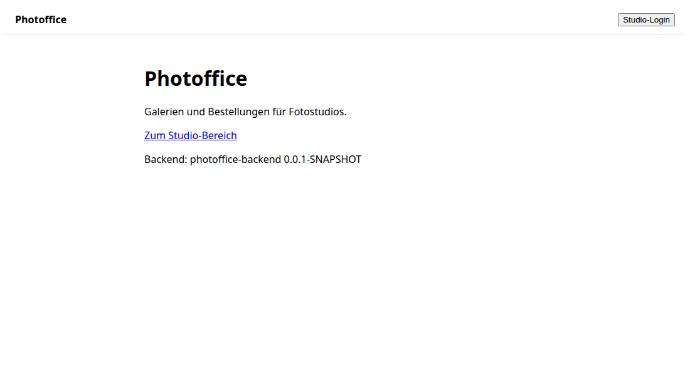
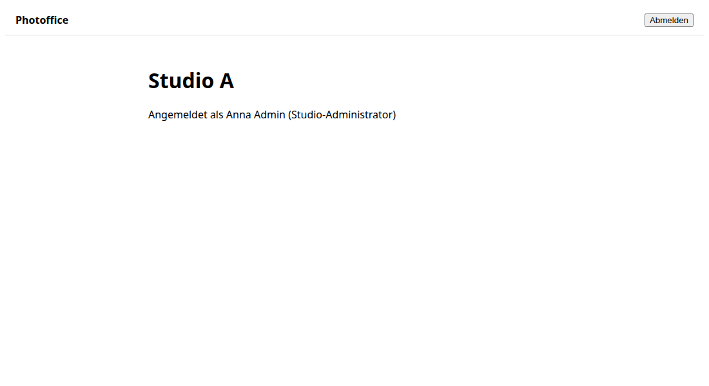

# Demo #6: Studio-Login und Rollen mit Keycloak

- **Issue / PR:** #6 / #26
- **Datum:** 2026-10-08
- **Agent / Maschine:** Claude Code / fin-de-nb-0072
- Nachträglich erstellt, als die Demo-Pflicht eingeführt wurde (#29).

## Was wurde umgesetzt
- Studio-Mitarbeiter melden sich über Keycloak an (Code Flow + PKCE). Das Studio ergibt sich aus der
  Keycloak-Organisation (Alias = Kürzel des Studios); alle Daten der Anfrage sind auf dieses Studio beschränkt.
- Rollen: Plattform-Betreiber, Studio-Admin, Fotograf. Plattform-Funktionen nur für den Betreiber,
  Studio-Funktionen nur für Mitglieder genau eines aktiven Studios, alles andere wird verweigert.
- Studio-Bereich im Frontend zeigt Studio, Benutzer und Rolle; Abmelden.

## So probierst du es aus
1. `docker compose up -d`, Backend mit Profil `dev`, `cd frontend && npm start`
2. http://localhost:4200 → "Studio-Login" → z. B. `admin-a` / `admin-a` (erst Benutzername, dann Passwort)
3. Weitere Benutzer: `foto-a`, `admin-b`, `operator` (Passwort = Benutzername)

## Screenshots
Startseite (nicht angemeldet):



Nach dem Login als `admin-a`:



## API-Beispiele
```bash
TOKEN=$(curl -s localhost:8180/realms/photoffice/protocol/openid-connect/token \
  -d grant_type=password -d client_id=photoffice-dev-cli -d username=admin-a -d password=admin-a \
  | python3 -c "import sys,json;print(json.load(sys.stdin)['access_token'])")
curl -s localhost:8080/api/studio/me -H "Authorization: Bearer $TOKEN"
```
```json
{"username":"admin-a","roles":["STUDIO_ADMIN"],"studio":{"id":"a0000000-0000-4000-8000-00000000000a","slug":"studio-a","name":"Studio A"},"displayName":"Anna Admin","email":"admin@studio-a.test"}
```
Ohne Token: `401`; `operator` auf `/api/studio/me`: `403`; `admin-a` auf `/api/platform/tenants`: `403`.

## Tests
- Backend: 11 Zugriffsregel-Tests, 6 Tests gegen echten Keycloak-Container mit der Realm-Datei.
- Frontend: 8 Unit-Tests; Playwright-E2E (5, lokal): Login je Rolle/Studio, Logout, Zugangsschutz.

## Noch offen / Einschränkungen
- Studios und Keycloak-Organisationen werden noch manuell bzw. über den Dev-Realm angelegt (#24).
- OIDC-Einstellungen im Frontend fest auf localhost (#28). E2E noch nicht in CI (#25).
- Noch schlichtes Design – Angular Material folgt mit #27.
