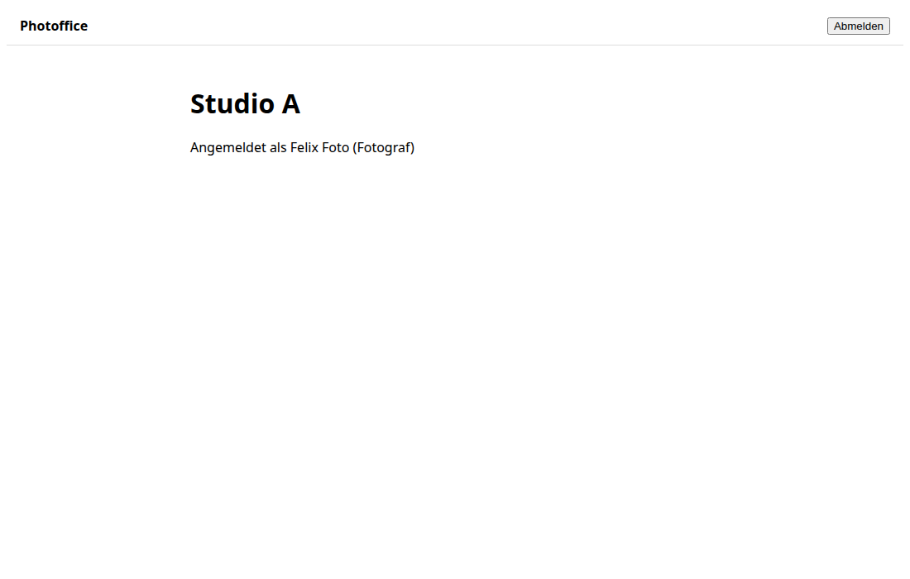

# Demo #29: Konventionen für parallele Arbeit und Demo-Pflicht

- **Issue / PR:** #29 / (siehe PR zu #29)
- **Datum:** 2026-10-08
- **Agent / Maschine:** Claude Code / fin-de-nb-0072

## Was wurde umgesetzt
- **AGENTS.md, Abschnitt "Parallel work":** Flyway-Migrationen mit Zeitstempel (`V<yyyyMMddHHmm>__...`) statt
  fortlaufender Nummer, `out-of-order` aktiviert; Regeln für gemeinsam bearbeitete Dateien, Modulgrenzen, Rebase vor dem PR.
- **AGENTS.md, Abschnitt "Demo after every finished issue":** Pflicht-Demo nach jedem Issue – im Repository
  (`docs/demos/`) und im Gespräch mit dem Nutzer.
- **Vorlage** `docs/demos/README.md` und **Screenshot-Hilfsskript** `frontend/scripts/screenshot.mjs`
  (inkl. Login mit Dev-Benutzern).
- **ADR 0005:** UI mit Angular Material und eigenem Design.
- **Roadmap #21** neu geordnet: neue Issues #27 (UI-Grundlage), #28 (Deployment), #29; Oberflächen-Issues hängen an #27.
- Nachträgliche Demo für #6: `docs/demos/0006-studio-login.md`.

## So probierst du es aus
```bash
docker compose up -d postgres keycloak
cd backend && ./mvnw spring-boot:run -Dspring-boot.run.profiles=dev
cd frontend && npm start
cd frontend && node scripts/screenshot.mjs /studio /tmp/studio.png --login foto-a --wait .welcome
```

## Screenshots
Mit dem Hilfsskript erzeugt (Login als `foto-a`, danach `/studio`):



## Tests
- Backend-Suite (37 Tests) mit `out-of-order` grün.

## Noch offen / Einschränkungen
- Die Regeln wirken nur, wenn alle Agenten `AGENTS.md` lesen (Claude Code über `CLAUDE.md`, Junie über `.junie/AGENTS.md`).
